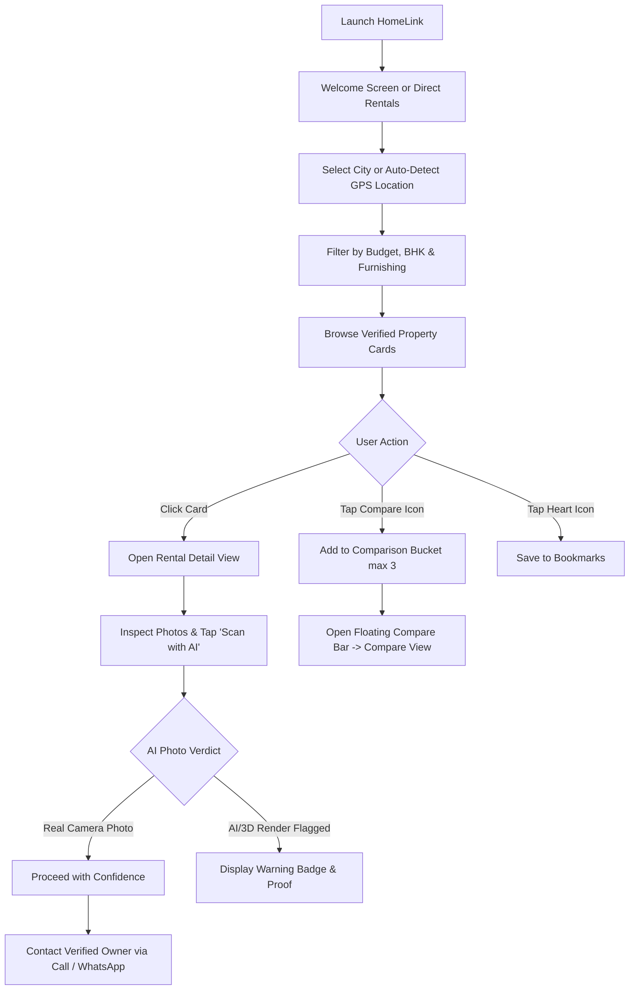
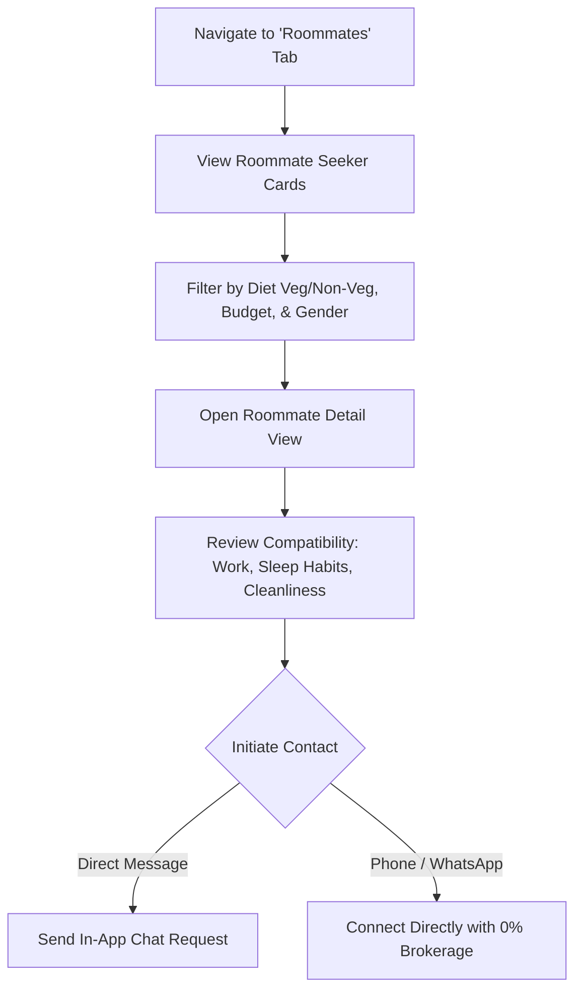
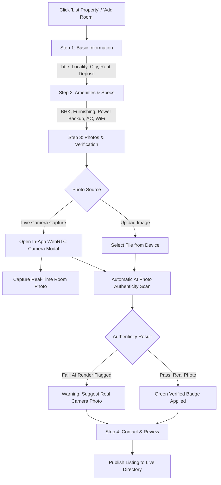
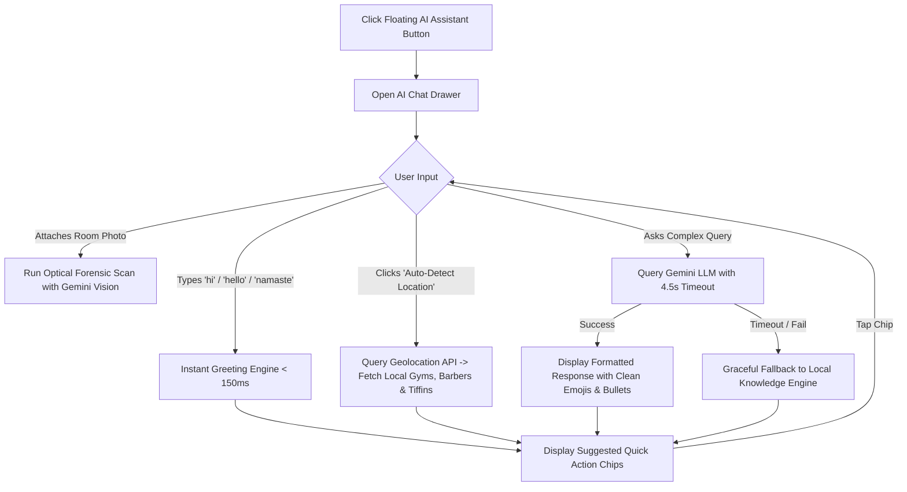

# HomeLink — App Flow & User Journey Document

**Document Version:** 2.0.0  
**Scope:** Navigation Routes, User Decision Trees & Interaction State Transitions

---

## 1. Top-Level Route Map

The HomeLink application features a single-page state-driven routing system managed via `AppContext`:

| Route Identifier | View Component | Primary Purpose |
| :--- | :--- | :--- |
| `welcome` | `WelcomeView` | Platform onboarding, value proposition, quick city selector, 0% brokerage highlight. |
| `rentals` | `RentalsView` | Searchable listing directory with filters, sorting, and map/list view toggles. |
| `rental-detail` | `RentalDetailView` | Full property specs, photo gallery, owner verification badge, AI photo inspection, direct contact. |
| `roommates` | `RoommatesView` | Co-living roommate seeker cards with lifestyle filters (diet, smoking, budget). |
| `roommate-detail` | `RoommateDetailView`| Detailed profile of potential flatmate with bio and contact options. |
| `compare` | `CompareView` | Side-by-side comparison matrix for up to 3 shortlisted properties. |
| `add-property` | `ListPropertyWizardView`| 4-step wizard for hosts to publish properties with live camera capture & AI photo check. |
| `owner-dashboard` | `OwnerDashboardView` | Host property management, status toggles (Available / Rented), inquiry tracking. |
| `saved` | `SavedView` | User's bookmarked properties and favorite roommate profiles. |
| `profile` | `ProfileView` | User account settings, role switching (Tenant / Host demo modes), and safety guidelines. |

---

## 2. Primary User Journey Flows

### 2.1 Tenant Room Discovery Journey

---

### 2.2 Roommate Matchmaking Journey

---

### 2.3 Property Owner Listing Wizard Flow

---

### 2.4 AI Assistant & Neighborhood Living Interaction

---

## 3. Modal & Overlay State Machine

- **AuthModal (`authMode`: 'login' | 'signup' | 'forgot'):** Handles credential entry, social login demos, and password recovery.
- **AIPhotoAuditModal (`auditImage`, `auditResult`):** Full-screen optical audit report showing authenticity score, sensor noise analysis, and verdict badge.
- **CameraCaptureModal (`isOpen`, `onCapture`):** Full-screen camera viewfinder with camera switcher (front/rear), flash indicator, and capture snapshot canvas.
- **MarkAsRentedModal (`propertyId`):** Allows hosts to toggle occupied status to prevent unwanted inquiries.
- **CompareToast / FloatingCompareBar:** Persistent dock when 1 to 3 properties are selected for comparison.
